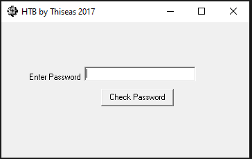
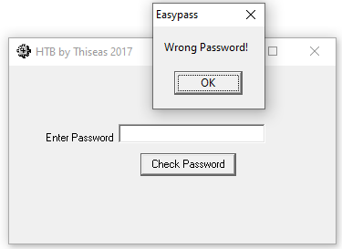

# identification

After un-compressing  the challenge file `Find The Easy Pass.zip`, we can find
a file named `EasyPass.exe` inside it.

We using `rz-bin` to identify the executable file.

```bash
C:\Users\User\Desktop\htb>rz-bin -I EasyPass.exe
arch     x86
baddr    0x400000
binsz    402432
bintype  pe
bits     32
canary   false
retguard false
class    PE32
cmp.csum 0x00063785
compiled Fri Jun 19 15:22:17 1992
crypto   false
endian   little
havecode true
hdr.csum 0x00000000
laddr    0x0
lang     c
linenum  true
lsyms    true
machine  i386
maxopsz  16
minopsz  1
nx       false
os       windows
overlay  false
cc       cdecl
pcalign  0
pic      false
relocs   false
signed   false
sanitiz  false
static   false
stripped false
subsys   Windows GUI
va       true
```

That's interesting, `EasyPass.exe` is an x86 program, it's a GUI program.

Now, we will run the program to have some better idea on what it's doing.



We click on the **Check Password**



Interesting, let's search for **Wrong Password!** in the executable.

```bash
C:\Users\User\Desktop\htb>rz-bin -iz EasyPass.exe | findstr /I Wrong

C:\Users\User\Desktop\htb>
```

We're unlucky but don't panic, we will launch a more thorough research:

```bash
C:\Users\User\Desktop\htb>rz-bin -izz EasyPass.exe | findstr /I Wrong
5483 0x00053600 0x00454200 15  16   CODE    ascii   Wrong Password!
```

The "Wrong Password!" string is located at **`0x00454200`** in the CODE section.

> ***rizin tips:*** The first search (`-iz`) works on some flag spaces but
> not on the whole file, while the second command (`-izz`) is more exhaustive.
